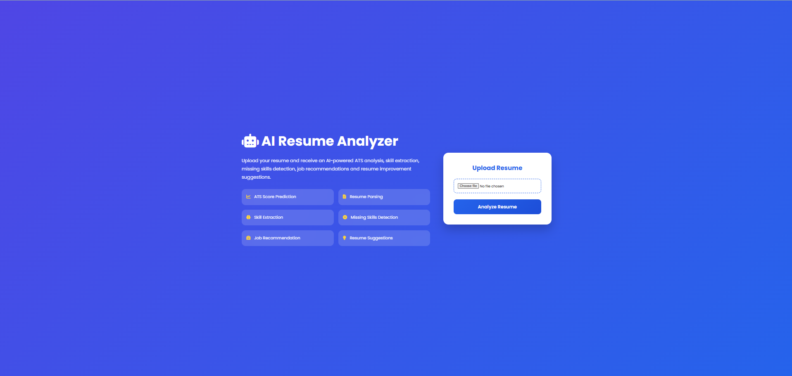
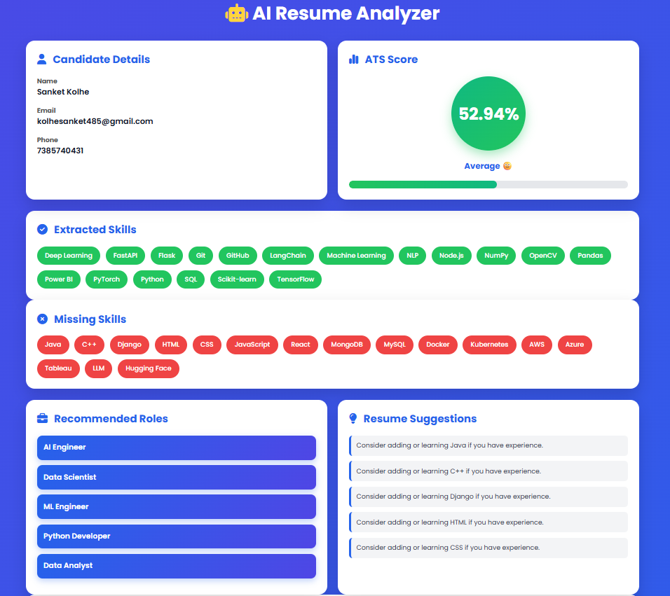
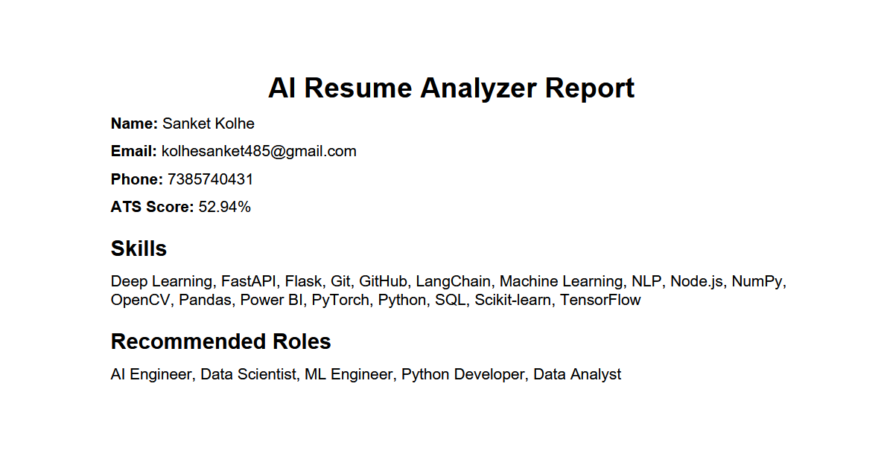
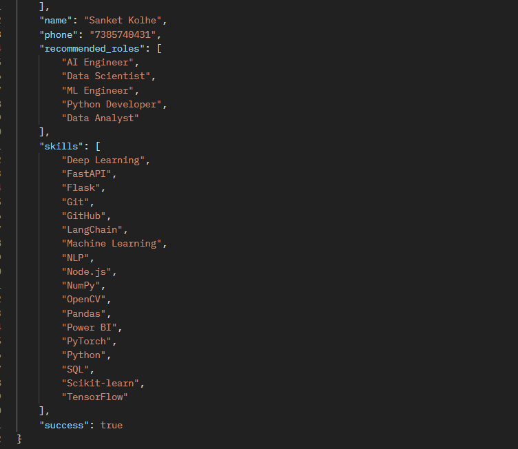
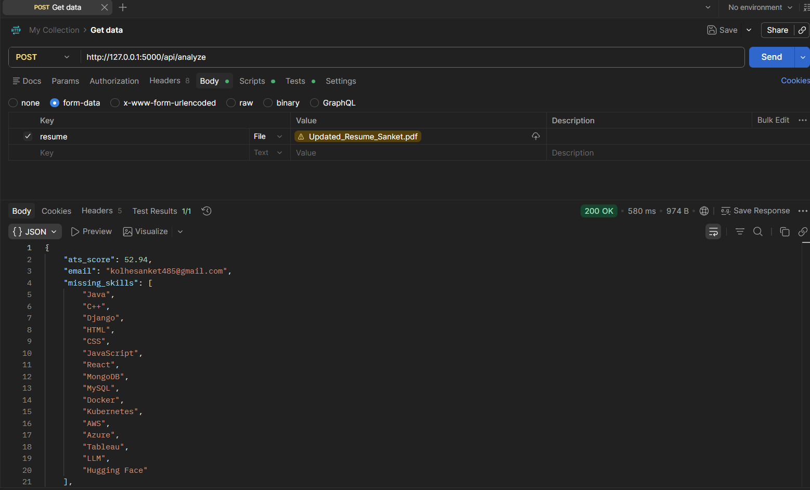

# AI Resume Analyzer & ATS Score Predictor

An AI-powered Resume Analyzer built with **Flask**, **Machine Learning**, and **Natural Language Processing (NLP)**. The application analyzes uploaded resumes, predicts the most suitable job category using a trained ML model, calculates an ATS score, identifies missing skills, recommends relevant job roles, and generates a downloadable PDF report.

---

## Features

- Upload Resume (PDF)
- Resume Text Extraction
- AI-Based Resume Classification
- ATS Score Prediction
- Candidate Information Extraction
  - Name
  - Email
  - Phone Number
- Skill Extraction
- Missing Skill Analysis
- Job Role Recommendation
- Download PDF Analysis Report
- REST API Support

---

## Machine Learning

### Dataset
- Resume Dataset (50MB+)
- 2,484 resumes
- 24 job categories

### Preprocessing
- Text Cleaning
- TF-IDF Vectorization
- Stopword Removal
- Lowercase Conversion

### Model
- Linear Support Vector Classifier (LinearSVC)

### Performance
- Accuracy: **72.23%**

---

## Tech Stack

### Backend
- Python
- Flask

### Machine Learning
- Scikit-learn
- Pandas
- NumPy
- Joblib

### Resume Processing
- PDFPlumber / PyPDF2
- Regular Expressions

### Frontend
- HTML
- CSS
- JavaScript
- Bootstrap

---

## Project Structure

```text
AI-Resume-Analyzer/
│
├── app.py
├── ats.py
├── recommender.py
├── resume_parser.py
├── report_generator.py
├── train_model.py
├── requirements.txt
├── README.md
├── Procfile
├── job_roles.csv
├── skills.csv
│
├── models/
│   └── resume_classifier.pkl
│
├── results/
│   ├── classification_report.txt
│   └── confusion_matrix.png
│
├── screenshots/
│   ├── home_page.png
│   ├── resume_dashboard_1.png
│   ├── resume_dashboard_2.png
│   ├── pdf_report.png
│   ├── api_testing.png
│   └── postman_api_response.png
│
├── static/
├── templates/
└── uploads/
```

---

## Installation

Clone the repository

```bash
git clone https://github.com/SanketKolhe2005/AI-Resume-Analyzer.git
```

Move into the project directory

```bash
cd AI-Resume-Analyzer
```

Install dependencies

```bash
pip install -r requirements.txt
```

Run the application

```bash
python app.py
```

Open your browser

```
http://127.0.0.1:5000
```

---

## Train the Model

```bash
python train_model.py
```

The trained model is stored in:

```
models/resume_classifier.pkl
```

Training results are saved in:

```
results/
├── classification_report.txt
└── confusion_matrix.png
```

---

## Application Workflow

1. Upload Resume (PDF)
2. Extract Resume Text
3. Predict Resume Category using AI
4. Extract Candidate Information
5. Calculate ATS Score
6. Identify Missing Skills
7. Recommend Job Roles
8. Generate PDF Report

---

## Screenshots

### Home Page



### Resume Analysis Dashboard




### PDF Report



### API Testing



### Postman API Response



---

## Results

- AI-based Resume Classification
- ATS Score Prediction
- Automatic Skill Extraction
- Missing Skill Detection
- Job Role Recommendation
- PDF Report Generation
- REST API Integration

---

## Future Enhancements

- Resume vs Job Description Matching
- Deep Learning-Based Resume Classification
- Sentence Transformer Similarity
- LLM-Powered Resume Suggestions
- Resume Ranking System
- Multi-language Resume Support

---

## Author

**Sanket Kolhe**

B.Tech Computer Engineering

MIT Academy of Engineering, Pune

**GitHub:** https://github.com/SanketKolhe2005

**LinkedIn:** https://www.linkedin.com/in/sanket-kolhe-b2683525b

---

## License

This project is developed for educational and internship purposes.
