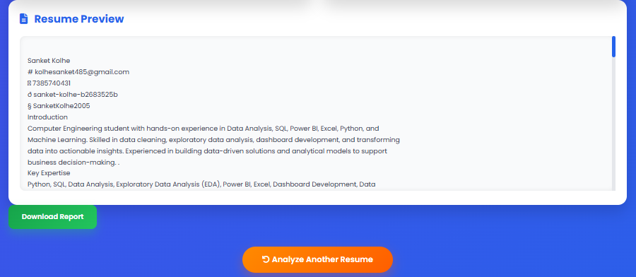

# 🤖 AI Resume Analyzer & ATS Score Predictor

An AI-powered Resume Analyzer built using **Flask**, **Python**, and **NLP** that analyzes uploaded resumes, extracts candidate details, calculates an ATS (Applicant Tracking System) score, identifies missing skills, recommends suitable job roles, and generates a downloadable PDF report.

---

# 📌 Features

- 📄 Upload Resume (PDF)
- 👤 Extract Candidate Name
- 📧 Extract Email Address
- 📱 Extract Phone Number
- 🧠 AI-Based Skill Extraction
- 📊 ATS Score Prediction
- ❌ Missing Skills Detection
- 💼 AI Job Role Recommendation
- 💡 Resume Improvement Suggestions
- 📄 Download PDF Analysis Report
- 🌐 REST API for Resume Analysis
- 🎨 Responsive Web Interface

---

# 🛠 Technologies Used

## Backend

- Python
- Flask
- ReportLab

## AI / NLP

- PyMuPDF (fitz)
- Pandas
- Scikit-learn

## Frontend

- HTML5
- CSS3
- JavaScript

---

# 📂 Project Structure

```text
Major_Project/
│
├── app.py
├── ats.py
├── recommender.py
├── resume_parser.py
├── report_generator.py
├── skills.csv
├── job_roles.csv
├── requirements.txt
├── README.md
│
├── templates/
│   ├── index.html
│   └── result.html
│
├── static/
│   ├── style.css
│   └── script.js
│
├── screenshots/
│   ├── home_page.png
│   ├── dashboard_1.png
│   ├── dashboard_2.png
│   ├── pdf_report.png
│   ├── api_testing.png
│   └── postman_api_response.png
│
└── uploads/
```

---

# ⚙ Installation

## Clone Repository

```bash
git clone https://github.com/SanketKolhe2005/internsSanket_INBT020381_iNeuBytes.git
```

## Navigate to the Project

```bash
cd Major_Project
```

## Install Dependencies

```bash
pip install -r requirements.txt
```

## Run the Application

```bash
python app.py
```

Open your browser and visit:

```
http://127.0.0.1:5000
```

---

# 🚀 REST API

## Analyze Resume

**POST**

```
/api/analyze
```

### Form Data

| Key | Type |
|------|------|
| resume | File |

### Sample JSON Response

```json
{
  "success": true,
  "name": "John Doe",
  "email": "john@example.com",
  "phone": "9876543210",
  "ats_score": 85,
  "skills": [
    "Python",
    "Flask",
    "SQL"
  ],
  "recommended_roles": [
    "AI Engineer",
    "Python Developer"
  ]
}
```

---

# 📊 ATS Score Calculation

The ATS score is calculated based on:

- Programming Languages
- Technical Skills
- AI & Machine Learning Libraries
- Frameworks
- Resume Keywords

---

# 💼 Recommended Job Roles

- AI Engineer
- Machine Learning Engineer
- Data Scientist
- Data Analyst
- Python Developer

---

# 📸 Screenshots

## 🏠 Home Page


---

## 📊 Resume Analysis Dashboard (Part 1)


---

## 📊 Resume Analysis Dashboard (Part 2)



---

## 📄 Generated PDF Report


---

## 🧪 API Testing


---

## 📬 Postman API Response


---

# 📈 Future Improvements

- Experience Extraction
- Education Detection
- Certifications Detection
- Resume Ranking
- Resume Keyword Optimization
- OCR Support for Image-based Resumes
- AI Chat Assistant
- Multiple Resume Comparison
- Grammar & Resume Formatting Suggestions

---

# 👨‍💻 Author

**Sanket Kolhe**

B.Tech Computer Engineering

MIT Academy of Engineering, Pune

**GitHub:** https://github.com/SanketKolhe2005

**LinkedIn:** https://www.linkedin.com/in/sanket-kolhe-b2683525b

---

# 📄 License

This project was developed as part of the **iNeuBytes Artificial Intelligence Internship** for educational and learning purposes.

---

## ⭐ If you found this project helpful, don't forget to star the repository!
