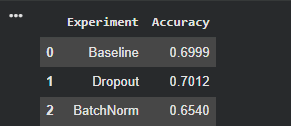
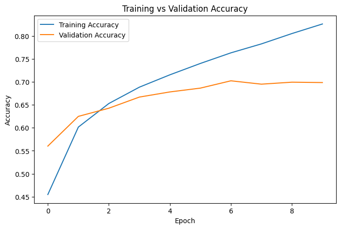
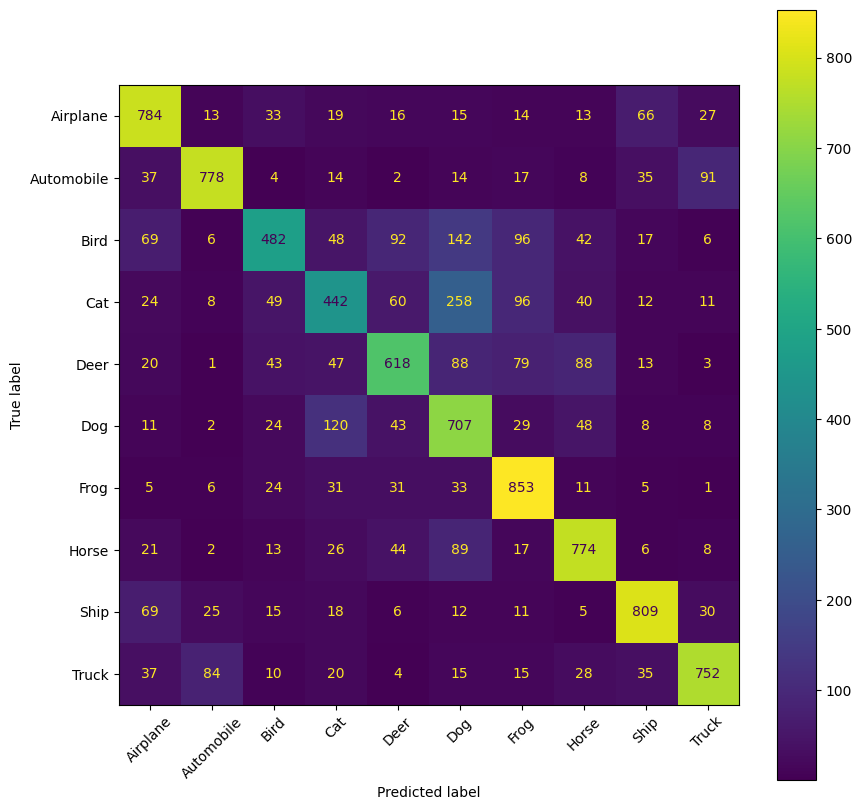

# 🖼️ Task 1: Computer Vision using CNN Models

## iNeuBytes Artificial Intelligence Internship

### 📌 Objective

The objective of this project is to build a Convolutional Neural Network (CNN) for image classification using the CIFAR-10 dataset. Multiple controlled experiments were performed to analyze how different architectural changes such as Dropout and Batch Normalization affect the model's performance.

---

# 📂 Dataset

**Dataset:** CIFAR-10

- Total Images: **60,000**
- Training Images: **50,000**
- Testing Images: **10,000**
- Number of Classes: **10**

### Classes

- ✈ Airplane
- 🚗 Automobile
- 🐦 Bird
- 🐱 Cat
- 🦌 Deer
- 🐶 Dog
- 🐸 Frog
- 🐴 Horse
- 🚢 Ship
- 🚚 Truck

---

# 🛠 Technologies Used

- Python
- TensorFlow
- Keras
- NumPy
- Pandas
- Matplotlib
- Scikit-learn
- Google Colab

---

# 📁 Project Structure

```text
Task_1/
│
├── Task1_CNN.ipynb
├── Final_CNN_Model.h5
├── baseline_cnn.h5
├── improved_cnn.h5
├── Final_CNN_Results.csv
├── cnn_experiment_results.csv
├── requirements.txt
├── README.md
│
└── screenshots/
    ├── model_comparison.png
    ├── confusion_matrix.png
    └── training_accuracy.png
```

---

# 🧪 Controlled Experiments

## Baseline CNN

Architecture

- Convolution Layer
- ReLU Activation
- MaxPooling
- Dense Layer
- Softmax Output

**Accuracy:** **69.99%**

---

## Experiment 1 – Dropout

Added Dropout layers to reduce overfitting.

**Accuracy:** **70.12%**

✅ Best Performing Model

---

## Experiment 2 – Batch Normalization

Added Batch Normalization layers.

**Accuracy:** **65.40%**

---

# 📊 Model Comparison

| Experiment | Accuracy |
|------------|---------:|
| Baseline CNN | 69.99% |
| Dropout CNN | **70.12%** |
| Batch Normalization CNN | 65.40% |

---

# 📈 Evaluation Metrics

The models were evaluated using:

- Accuracy
- Precision
- Recall
- F1 Score
- Confusion Matrix

---

# 📸 Results

## Model Comparison



---

## Training vs Validation Accuracy



---

## Confusion Matrix



---

# 🔍 Observations

- The Dropout model achieved the highest accuracy (**70.12%**) and reduced overfitting compared to the baseline model.
- Batch Normalization alone did not improve performance for this architecture.
- Most classification errors occurred between visually similar classes such as **Cat–Dog**, **Bird–Deer**, and **Automobile–Truck**.
- The model classified **Frog**, **Ship**, and **Airplane** with relatively high accuracy.

---

# 🚀 Future Improvements

- Data Augmentation
- Transfer Learning (ResNet50, EfficientNet)
- Hyperparameter Optimization
- Learning Rate Scheduling
- Early Stopping
- Model Quantization
- Fine-tuning with Pre-trained CNN Models

---

# 👨‍💻 Author

**Sanket Kolhe**

B.Tech Computer Engineering  
MIT Academy of Engineering, Pune

---

# 📄 License

This project was developed as part of the **iNeuBytes Artificial Intelligence Internship** for educational purposes.
