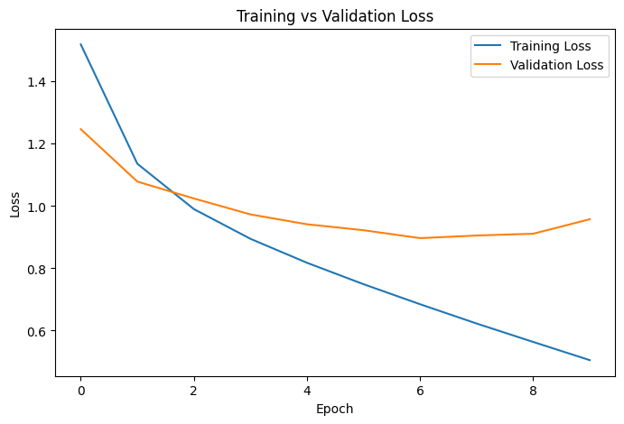

# 🖼️ Task 1: Computer Vision using CNN Models

## iNeuBytes Artificial Intelligence Internship

## 📌 Objective

The objective of this project is to build and compare multiple Convolutional Neural Network (CNN) models for image classification using the CIFAR-10 dataset. Different CNN architectures were evaluated to study the impact of Dropout and Batch Normalization on model performance.

---

# 📂 Dataset

**Dataset:** CIFAR-10

- Total Images: **60,000**
- Training Images: **50,000**
- Testing Images: **10,000**
- Number of Classes: **10**

### Classes

- ✈ Airplane
- 🚗 Automobile
- 🐦 Bird
- 🐱 Cat
- 🦌 Deer
- 🐶 Dog
- 🐸 Frog
- 🐴 Horse
- 🚢 Ship
- 🚚 Truck

---

# 🛠 Technologies Used

- Python
- TensorFlow
- Keras
- NumPy
- Pandas
- Matplotlib
- Scikit-learn
- Google Colab

---

# 📁 Project Structure

```
Task1/
│
├── Task1_CNN.ipynb
├── Final_CNN_Model.h5
├── baseline_cnn.h5
├── improved_cnn.h5
├── Final_CNN_Results.csv
├── cnn_experiment_results.csv
├── requirements.txt
├── README.md
│
└── screenshots/
    ├── Classification Report.png
    ├── Final CNN Results.png
    ├── confusion_matrix.png
    ├── model_comparison.png
    ├── training_accuracy.png
    └── training_Validation_loss.png
```

---

# 🧪 CNN Experiments

## 1️⃣ Baseline CNN

Architecture:

- Convolution Layer
- ReLU Activation
- MaxPooling
- Dense Layer
- Softmax Output

**Accuracy:** 69.99%

---

## 2️⃣ Dropout CNN

Added Dropout layers to reduce overfitting.

**Accuracy:** 70.12%

✅ **Best Performing Model**

---

## 3️⃣ Batch Normalization CNN

Added Batch Normalization layers.

**Accuracy:** 65.40%

---

# 📊 Model Comparison

| Model | Accuracy |
|--------|----------|
| Baseline CNN | 69.99% |
| Dropout CNN | 70.12% |
| Batch Normalization CNN | 65.40% |

---

# 📈 Evaluation Metrics

The models were evaluated using:

- Accuracy
- Precision
- Recall
- F1-Score
- Confusion Matrix
- Classification Report

---

# 📸 Results

## Model Comparison


---

## Training Accuracy


---

## Training & Validation Loss



---

## Confusion Matrix


---

## Classification Report


---

## Final CNN Results


---

# 🔍 Observations

- The Dropout CNN achieved the highest accuracy (**70.12%**) and reduced overfitting.
- Batch Normalization alone did not improve performance for this architecture.
- The confusion matrix shows that most errors occur between visually similar classes.
- Precision, Recall, and F1-score indicate balanced performance across most classes.
- Training and validation curves demonstrate stable convergence with Dropout.

---

# 🚀 Future Improvements

- Data Augmentation
- Transfer Learning (ResNet50, EfficientNet, MobileNetV2)
- Hyperparameter Tuning
- Learning Rate Scheduling
- Early Stopping
- Model Quantization
- Fine-tuning Pre-trained CNN Models

---

# 👨‍💻 Author

**Sanket Kolhe**

B.Tech Computer Engineering

MIT Academy of Engineering (MITAOE), Pune

GitHub: https://github.com/SanketKolhe2005

---

# 📄 License

This project was developed as part of the **iNeuBytes Artificial Intelligence Internship** for educational purposes.
