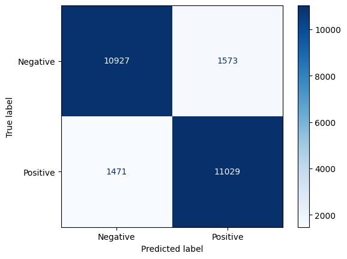
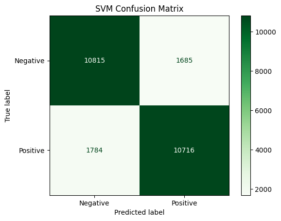
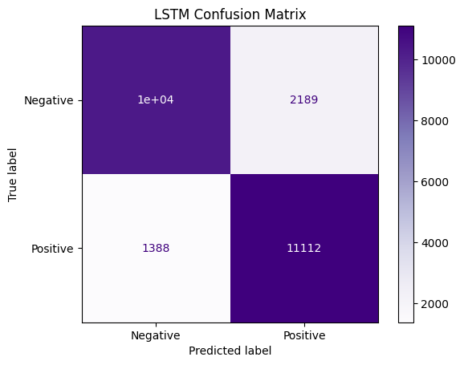

# 😊 Task 2: Sentiment Analysis using Machine Learning and Deep Learning

## iNeuBytes Artificial Intelligence Internship

### 📌 Objective

The objective of this project is to perform sentiment analysis on the IMDb Movie Reviews dataset using both Machine Learning and Deep Learning models. The performance of Logistic Regression, Support Vector Machine (SVM), and Long Short-Term Memory (LSTM) models is compared using classification metrics and confusion matrices.

---

# 📂 Dataset

**Dataset:** IMDb Movie Reviews Dataset

- Total Reviews: **50,000**
- Positive Reviews: **25,000**
- Negative Reviews: **25,000**
- Training Split: **80%**
- Testing Split: **20%**

---

# 🛠 Technologies Used

- Python
- TensorFlow
- Keras
- Scikit-learn
- Pandas
- NumPy
- Matplotlib
- Google Colab

---

# 📁 Project Structure

```text
Task_2/
│
├── Task_2_Sentiment_Analysis_using_Machine_Learning_and_Deep_Learning.ipynb
├── logistic_model.pkl
├── svm_model.pkl
├── lstm_sentiment_model.keras
├── Model Comparison Chart.png
├── requirements.txt
├── README.md
│
└── screenshots/
    ├── Confusion_Matrix_Logistic.png
    ├── Confusion_Matrix_SVM.png
    └── Confusion_Matrix_LSTM.png
```

---

# 🧪 Models Implemented

## 1️⃣ Logistic Regression

- TF-IDF Vectorization
- Baseline Machine Learning Model
- Fast Training and Prediction

---

## 2️⃣ Support Vector Machine (SVM)

- TF-IDF Vectorization
- Linear Kernel
- High-dimensional Text Classification

---

## 3️⃣ Long Short-Term Memory (LSTM)

- Tokenization
- Embedding Layer
- LSTM Layer
- Dense Output Layer
- Binary Classification

---

# 📊 Model Performance

| Model | Accuracy |
|--------|---------:|
| Logistic Regression | **87.82%** |
| Support Vector Machine | **86.08%** |
| LSTM | **85.69%** |

---

# 📈 Evaluation Metrics

The models were evaluated using:

- Accuracy
- Precision
- Recall
- F1 Score
- Confusion Matrix

---

# 📸 Results

## 📊 Model Comparison


---

## 📈 Logistic Regression Confusion Matrix



---

## 📈 Support Vector Machine (SVM) Confusion Matrix



---

## 📈 LSTM Confusion Matrix



---

# 🔍 Observations

- Logistic Regression achieved the highest accuracy (**87.82%**) among all models.
- Support Vector Machine achieved **86.08%** accuracy with competitive performance.
- LSTM achieved **85.69%** accuracy and effectively captured sequential information in text.
- Logistic Regression produced the fewest misclassifications and offered the best balance of accuracy and computational efficiency.
- Classical Machine Learning models performed slightly better than the Deep Learning model on the IMDb dataset used in this project.

---

# 🚀 Future Improvements

- Bidirectional LSTM
- GRU Networks
- BERT Transformer
- RoBERTa
- Hyperparameter Optimization
- Attention Mechanism
- Transfer Learning
- Larger NLP Datasets
- Real-Time Sentiment Prediction Web Application

---

# 👨‍💻 Author

**Sanket Kolhe**

B.Tech Computer Engineering

MIT Academy of Engineering, Pune

GitHub: https://github.com/SanketKolhe2005

LinkedIn: https://www.linkedin.com/in/sanket-kolhe-b2683525b

---

# 📄 License

This project was developed as part of the **iNeuBytes Artificial Intelligence Internship** for educational purposes.

---

⭐ If you found this project helpful, don't forget to star the repository!
